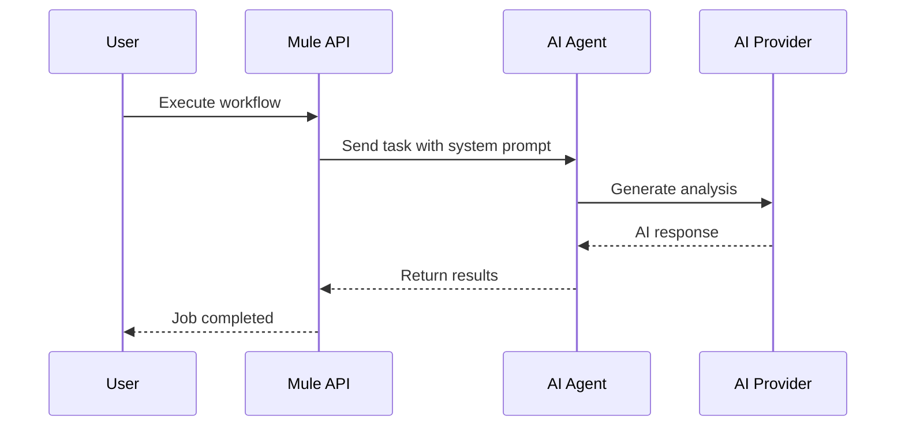

# Creating Your First Agent Workflow

In this tutorial, you'll create a simple workflow that uses an AI agent to analyze a code repository and generate a summary. This will introduce you to Mule's core concepts: agents, workflows, and job execution.

## What You'll Build

By the end of this tutorial, you'll have:

1. An AI agent configured for code analysis
2. A workflow with an agent step
3. A completed job with analysis results

## Step 1: Configure an AI Provider

Before creating an agent, you need an AI provider. If you haven't already, configure one:

```bash
# List available providers
curl http://localhost:8140/api/v1/providers

# Create an OpenAI provider (example)
curl -X POST http://localhost:8140/api/v1/providers \
  -H "Content-Type: application/json" \
  -d '{
    "name": "openai",
    "type": "openai",
    "api_key": "'"$OPENAI_API_KEY"'",
    "default_model": "gpt-4"
  }'
```

Or use the web UI at `http://localhost:8140` to configure providers through the UI.

## Step 2: Create an Agent

Agents are AI assistants with specific purposes. For this tutorial, create a code analysis agent:

```bash
curl -X POST http://localhost:8140/api/v1/agents \
  -H "Content-Type: application/json" \
  -d '{
    "name": "code-analyzer",
    "description": "Analyzes code repositories and generates summaries",
    "provider_id": "<your-provider-id>",
    "model_id": "gpt-4",
    "system_prompt": "You are a code analysis assistant. When given a repository path, analyze the codebase structure, identify key files, and provide a concise summary of the project purpose and architecture."
  }'
```

Save the agent ID from the response - you'll need it for the workflow.

## Step 3: Create a Workflow

Workflows define how tasks are executed. Create a simple workflow with one agent step:

```bash
curl -X POST http://localhost:8140/api/v1/workflows \
  -H "Content-Type: application/json" \
  -d '{
    "name": "code-analysis-workflow",
    "description": "Analyzes a code repository using an AI agent",
    "is_async": false
  }'
```

Save the workflow ID. Now add a step that uses your agent:

```bash
curl -X POST http://localhost:8140/api/v1/workflows/<workflow-id>/steps \
  -H "Content-Type: application/json" \
  -d '{
    "step_order": 1,
    "step_type": "agent",
    "agent_id": "<your-agent-id>",
    "config": {
      "task_prompt": "Analyze the repository at {{.input.repository_path}} and provide a summary of the codebase structure."
    }
  }'
```

## Step 4: Execute the Workflow

Now execute the workflow with an input:

```bash
curl -X POST http://localhost:8140/api/v1/workflows/<workflow-id>/execute \
  -H "Content-Type: application/json" \
  -d '{
    "input": {
      "repository_path": "/path/to/your/repo"
    }
  }'
```

The response includes a job ID for tracking:

```json
{
  "job_id": "abc123",
  "status": "queued"
}
```

## Step 5: Monitor Execution

Check the job status and retrieve results:

```bash
# Get job status
curl http://localhost:8140/api/v1/jobs/<job-id>

# Get job steps
curl http://localhost:8140/api/v1/jobs/<job-id>/steps
```

A completed job response looks like:

```json
{
  "id": "abc123",
  "workflow_id": "def456",
  "status": "completed",
  "input": {
    "repository_path": "/path/to/your/repo"
  },
  "output": {
    "summary": "This codebase is a Go-based API server with REST endpoints..."
  },
  "created_at": "2026-03-21T10:00:00Z",
  "completed_at": "2026-03-21T10:01:30Z"
}
```

## Understanding the Flow

Here's how the pieces connect:



## Adding More Steps

You can extend this workflow with additional steps. For example, add a validation step:

```bash
# Add a WASM validation step
curl -X POST http://localhost:8140/api/v1/workflows/<workflow-id>/steps \
  -H "Content-Type: application/json" \
  -d '{
    "step_order": 2,
    "step_type": "wasm_module",
    "wasm_module_id": "<your-validation-module-id>",
    "config": {
      "validation_type": "check_summary_length",
      "min_length": 100
    }
  }'
```

Steps execute sequentially - the agent step runs first, then the validation module checks the output.

## Using the Web UI

You can also manage workflows through the web UI at `http://localhost:8140`:

1. Navigate to the Agents tab to create and manage agents
2. Navigate to the Jobs tab to create and monitor workflows
3. Use the WASM Modules tab to manage validation modules

## Next Steps

Congratulations! You've created your first Mule workflow. Continue learning:

- [Multi-Agent Workflows](/docs/Advanced/multi-agent) - Coordinate multiple agents
- [WASM Modules](/docs/Advanced/wasm-modules) - Add custom validation logic
- [Building a Custom WASM Module](/docs/Tutorials/building-wasm-module) - Create your own modules

## Troubleshooting

**Agent not responding?**
- Check that your AI provider has credits/quota remaining
- Verify the provider API key is correct
- Check the job logs for error messages

**Workflow stuck in queued state?**
- Ensure the agent ID in the step exists
- Check that the workflow is properly configured

**Invalid JSON response?**
- Verify your JSON syntax is correct
- Ensure all required fields are present
